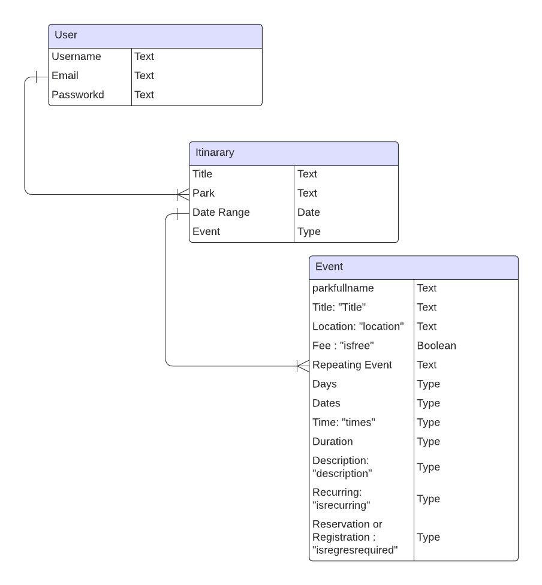

# ParkPioneer

A web application to create itinerary for National Park visits
Park Pioneer aims to facilate the planning process when you visit National Parks. Built using Django, a high-level Python web framework, this project offers a unique experience for the user to . Whether you're a traveler looking to plan your itinerary or a developer interested in exploring Django applications, Park Pioneer has something for you.

User Authentication: Implement user authentication to allow users to sign up, log in, and manage their accounts securely.

Itinerary Creation: Enable users to create new itineraries by providing details such as title, park name, start date, and end date.

Search Park Events: Integrate with external APIs like the National Park Service (NPS) API to search for events happening in specific parks within a given timeframe.

Event Management: Allow users to view detailed information about park events, such as title, location, date, time, and description.

First Clone this repo:
`git clone <https://github.com/ltcervan/ParkPioneer>`
Navigate to the Project Directory:
`cd <parkpioneer>`
Install Dependencies:
`pip install -r requirements.txt`
Apply Database Migrations:
`python manage.py migrate`
Create a Superuser (optional):
`python manage.py createsuperuser`
Run the Development Server:
`python manage.py runserver`

Technologies
Frontend Technologies:
HTML5
CSS3 (including preprocessors like Sass or Less)
JavaScript (and frameworks/libraries like React, Angular, or Vue.js)
Responsive Web Design

Backend Technologies:
Python (Django)

Databases:
SQL databases (PostgreSQL)

